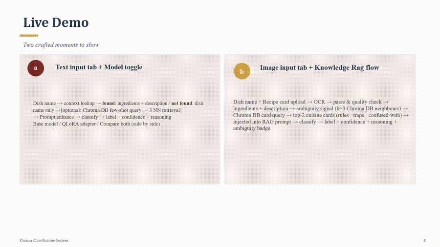
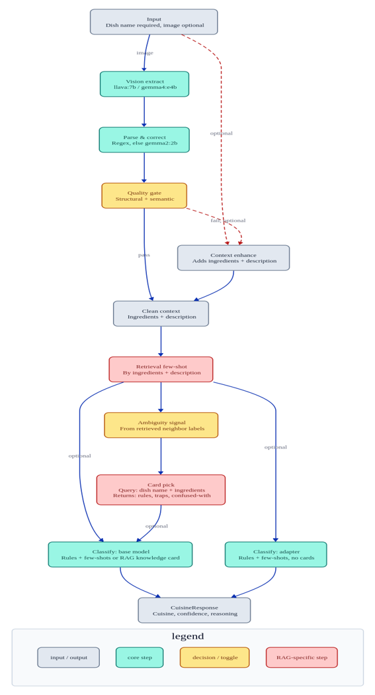

## Project

**Cuisine Classifier** — given a dish name (or recipe card image), classifies it into one of six cuisine types: Italian, Chinese, Mexican, Indian, American, or Other.

A RAG + LoRA fine-tuned multimodal pipeline: retrieval-augmented few-shot prompting, a LoRA-adapted gemma2:2b classifier, and vision-based recipe extraction from images — reaching 90.5% accuracy (up from a 71% base-model baseline).

## Demo

**Text input + model comparison** — base model vs. LoRA adapter, side by side


**Image upload + cuisine-knowledge RAG** — recipe card → vision extraction → retrieval-augmented classification with full reasoning


Full documentation: [src/cuisine_classifier/README.md](src/cuisine_classifier/README.md)

## Architecture



## Quick Start

```bash
# CLI
uv run python -m cuisine_classifier "Vegetable Quesadillas"

# Streamlit app
uv run streamlit run app.py
```

## Repository Layout

```
src/cuisine_classifier/   # Classifier package (main README lives here)
retrieval/                # ChromaDB vector stores and population scripts
models/                   # Fine-tuned embedding model (all-mpnet-base-v2)
data/                     # Recipe dataset, eval sets, fine-tuning data
specs/                    # Weekly implementation specs (Weeks 1–7)
app.py                    # Streamlit UI
Modelfile                 # Ollama model definition for the LoRA adapter
```

## Weekly Progression

| Week | Feature |
|------|---------|
| 1 | Prompt engineering + dataset context lookup |
| 2 | Embedding fine-tuning (all-mpnet-base-v2, CoSENTLoss) |
| 3 | Few-shot retrieval via ChromaDB |
| 4 | Structured output (Pydantic), static few-shot examples, dataset labeling |
| 5 | LoRA adapter fine-tuning (gemma2:2b, Unsloth, Colab) |
| 6 | Cuisine knowledge RAG — ambiguity signal + knowledge cards |
| 7 | Vision extraction from recipe card images (llava:7b) |

## Results (42-dish eval set)

| Mode | Accuracy |
|------|----------|
| Base model (prompt-only) | 71% |
| Context-enhanced | 73.8% |
| Few-shot retrieval (mpnet) | 78.6% |
| LoRA adapter | 85.7% |
| Cuisine knowledge RAG | **90.5%** |
